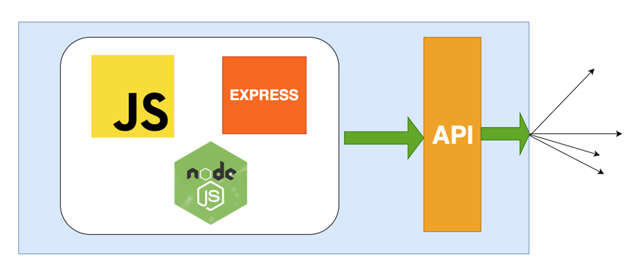

# Basic API REST Citas

Node.js, Express.js, MySQL, Sequelize and Typescript Basic REST API.

Actividad calificable 6

## Features and Functionalities 😃

- Node, Express, Typescript, MySQL and Sequelize as ORM Basic REST API
- CRUD Operations (A Controller for this)
- SQL for database: Relational MySQL - Use ORM Sequelize

## Tech Stack 💻

- [Node](https://nodejs.org/en)
- [Express](https://expressjs.com/)
- [MySQL](https://www.mysql.com)
- [Typescript](https://nodejs.dev/en/learn/nodejs-with-typescript/)
- [Sequelize](https://sequelize.org)

## Installation and Running App :zap:

**1. Clone this repo by running the following command :-**

```bash
 git clone https://github.com/devtraumatic/api-citas-sequelize-ts.git
 cd api-citas-sequelize-ts
```

**2. Install the required package :-**

```bash
 npm install
```

**3. Now run the npm command to start the project :-**

```bash
 npm run dev
```

**4.** **🎉 Open postman and test the rest api on this url `https://127.0.0.1:3000`**

Remember that the `.env` file must be created for the API to work.

Remember to create the database. It is not necessary to run script to create tables or other specifications, as this is done by the ORM.

Additionally this project uses: 

- [TS-Nodemon](https://stackoverflow.com/questions/37979489/how-to-watch-and-reload-ts-node-when-typescript-files-change)
- [body-parser](https://www.npmjs.com/package/body-parser)
- [Dotenv](https://www.npmjs.com/package/dotenv)
- [MySQL2](https://www.npmjs.com/package/mysql2)
- [Cors](https://www.npmjs.com/package/cors)

## Data model

```sql
DROP DATABASE IF EXISTS citas;

CREATE DATABASE IF NOT EXISTS citas CHARACTER SET utf8mb4;

USE citas;

CREATE TABLE
    doctor (
        id_profesional INT NOT NULL,
        nombre VARCHAR(50) NOT NULL,
        apellido VARCHAR(50) NOT NULL,
        correo VARCHAR(50) NOT NULL,
        especialidad ENUM(
            'medicina_interna',
            'medicina_general'
        ) NOT NULL,
        PRIMARY KEY (id_profesional)
    );

CREATE TABLE
    paciente(
        id_numeroCedula INT NOT NULL,
        nombre VARCHAR(50) NOT NULL,
        apellido VARCHAR(50) NOT NULL,
        telefono VARCHAR(15) NOT NULL,
        edad DATE NOT NULL,
        PRIMARY KEY (id_numeroCedula)
    );

CREATE TABLE
    cita (
        fecha_hora DATETIME NOT NULL,
        id_profesional INT NOT NULL,
        id_numeroCedula INT NOT NULL,
        FOREIGN KEY(id_profesional) REFERENCES doctor (id_profesional),
        FOREIGN KEY(id_numeroCedula) REFERENCES paciente (id_numeroCedula),
        PRIMARY KEY(
            id_profesional,
            id_numeroCedula,
            fecha_hora
        )
    );
```


## API Reference

#### Citas

```http
  GET /api/citas
```
```http
  POST /api/citas
```
```http
  PUT /api/citas
```
```http
  DELETE /api/citas
```


#### Pacientes
```http
  GET /api/pacientes
```
```http
  POST /api/pacientes
```
```http
  PUT /api/pacientes
```
```http
  DELETE /api/citas
```
#### Doctores
```http
  GET /api/doctores
```
```http
  POST /api/doctores
```
```http
  PUT /api/doctores
```
```http
  DELETE /api/doctores
```



Created by: Karol G
